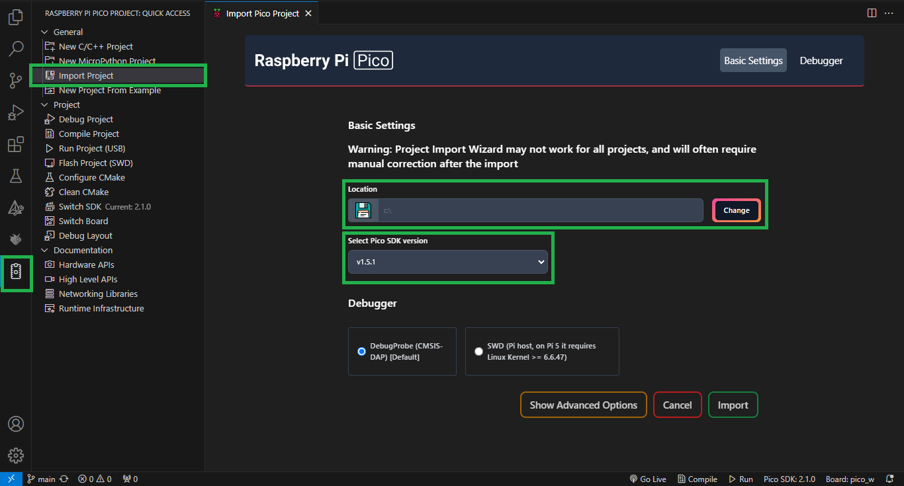
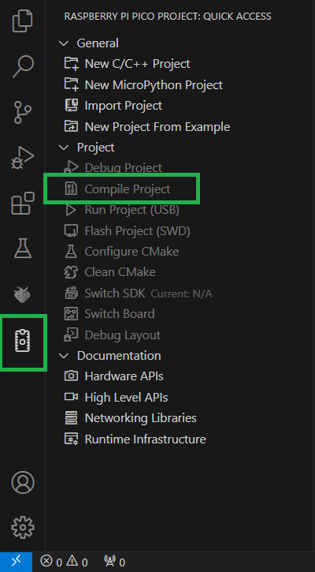

# Controle de Pinos GPIO com Teclado Matricial  

## Descrição do Projeto  

Este projeto consiste no controle de pinos GPIO utilizando um teclado matricial 4x4 para acionar 3 LEDs e um buzzer, empregando a placa Raspberry Pi Pico W. A simulação foi realizada no ambiente Wokwi, integrado ao VS Code, com código escrito em C.  

## Pré-requisitos  

Antes de executar o projeto, certifique-se de ter os seguintes softwares e ferramentas instalados:  

- [Visual Studio Code (VS Code)](https://code.visualstudio.com/download)  
- [Extensão Raspberry Pi Pico para VS Code](https://marketplace.visualstudio.com/items?itemName=raspberry-pi.raspberry-pi-pico)  
- [Extensão Wokwi Simulator para VS Code](https://marketplace.visualstudio.com/items?itemName=Wokwi.wokwi-vscode)  
- [Git](https://git-scm.com/downloads) (instalado e configurado no sistema operacional)  
- [SDK para Raspberry Pi Pico (Pico SDK)](#instalação-e-configuração-do-ambiente)  

Além disso, será necessário possuir uma conta no [site oficial do Wokwi](https://wokwi.com/).  

## Estrutura do Repositório  

```
├── .vscode/                # Configurações específicas do projeto para o VS Code  
├── img/                    # Imagens utilizadas no README para detalhar o projeto  
├── .gitignore              # Arquivos ignorados pelo Git  
├── CMakeLists.txt          # Configuração do CMake para o projeto  
├── diagram.json            # Arquivo de configuração para o simulador Wokwi
├── pico_sdk_import.cmake   # Configuração para importar o Pico SDK
├── projeto_embarcados.c    # Código-fonte principal do projeto
├── wokwi.toml              # Arquivo de configuração do Wokwi
└── README.md               # Instruções e detalhes do projeto  
```
`OBS.:` o subdiretório `build/` será adicionado ao diretório principal após a configuração automática do CMake.  

## Instalação e Configuração do Ambiente
1. Clone este repositório para seu ambiente local:  
   ```
   git clone https://github.com/HaniOliveira/Microcontroladores-GPIO-ATIVIDADE-1.git  
   ```

2. Com o VS Code aberto, configure o ambiente de desenvolvimento do Pico SDK, seguindo as instruções:  
    - O Pico SDK pode ser configurado de forma automática durante a configuração do projeto através da extensão Raspberry Pi Pico no VS Code.  
      
    - Passo a passo:  
    `1º:` acesse a extensão Raspberry Pi Pico;  
     `2º:` selecione a opção `Import Project`;  
    `3º:` adicione o caminho do projeto no seu dispositivo, selecione a versão do Pico SDK (pode ser a versão 1.5.1), e por fim clique em `Import`.  
    `OBS.:` após isso, a própria ferramenta realizará a configuração do Pico SDK. Durante o processo de configuração, notificações serão exibidas no canto inferior direito da tela, indicando cada etapa.  

3. Compile o projeto:  
  
  - Passo a passo:  
    `1º:` com o projeto aberto no VS Code, acesse a extensão Raspberry Pi Pico;  
    `2º:` clique na opção `Compile Project` e aguarde o processo de compilação.   

4. Com o VS Code aberto, configure o ambiente Wokwi, seguindo as instruções:
    - A configuração do Wokwi para VS Code pode ser realizada seguindo as orientações disponíveis na [documentação oficial](https://docs-wokwi-com.translate.goog/vscode/getting-started?_x_tr_sl=en&_x_tr_tl=pt&_x_tr_hl=pt&_x_tr_pto=tc&_x_tr_hist=true).

5. Inicie a simulação do projeto:  
    - Para iniciar a simulação do projeto clique no arquivo `diagram.json`, logo em seguida será aberta uma tela com a simulação do projeto, contendo os componentes como a placa Raspberry Pi Pico W, o teclado matricial 4x4, entre outros. Após a abertura da simulação do projeto, clique no botão verde de começar.  

## Estrutura de Controle  

- Utilize o teclado matricial para controlar os LEDs e o buzzer.  

- Teclado Matricial 4x4:  
  - Permite a entrada de comandos.  
  - Cada tecla corresponde a uma ação específica.  
    - Tecla 1: acende o LED azul;  
    - Tecla 2: acende o LED verde;  
    - Tecla 3: acende o LED vermelho;  
    - Tecla 7: acendem os três LEDs e faz o buzzer emitir um som.    

## Vídeo de Apresentação da Solução

Para mais detalhes sobre a implementação e os resultados, assista ao vídeo da solução: [Link para o vídeo](#).  